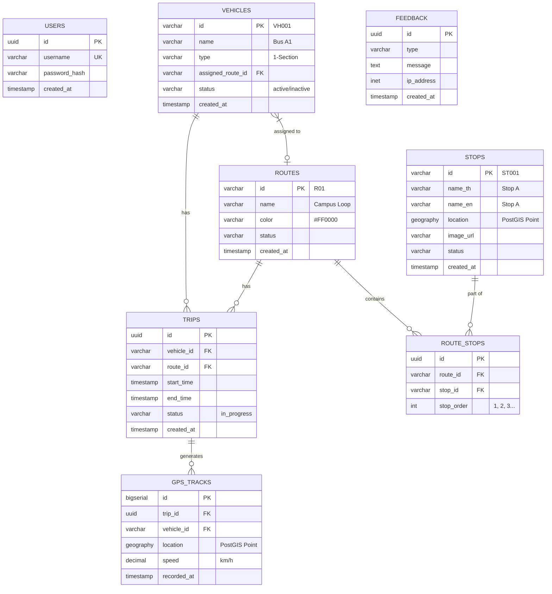
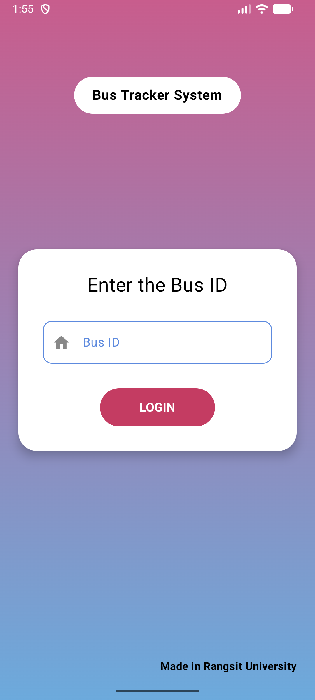
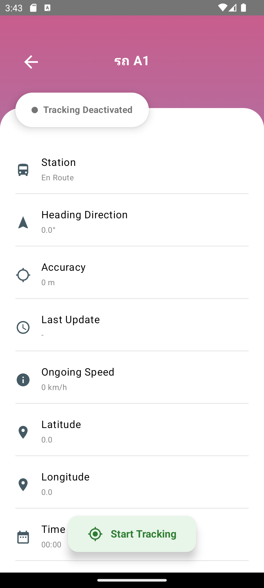

# RSU Bus Tracker (Rangsit University Shuttle System)

**RSU Bus Tracker** is a comprehensive "Mega Project" designed to modernize the shuttle bus operations at Rangsit University. This system replaces legacy hardware with a modern, stable solution that provides real-time tracking, estimated passenger density via Computer Vision, and route optimization data.

## Project Overview

This repository contains the source code for the **Driver-Side Mobile Application**. It serves as the primary data sender, utilizing Android Foreground Services to broadcast precise GPS coordinates to the central server while the bus is in operation.

### Key Features
* **Real-Time Tracking:** High-frequency GPS updates (1Hz - 3Hz) sent to a PostgreSQL/PostGIS backend.
* **Modern UI/UX:** Built entirely with **Kotlin Jetpack Compose**, featuring bouncy animations and gradient aesthetics.
* **Driver Authentication:** Secure login system linking specific vehicles to active trips.
* **Background Operation:** Robust `ForegroundService` implementation ensures tracking continues even when the screen is locked.
* **Passenger Counting (Planned):** Integration with on-board cameras and **OpenCV** to count passengers boarding and alighting.

---

## Tech Stack

### Mobile Application (Android)
* **Language:** Kotlin
* **UI Toolkit:** Jetpack Compose (Material3)
* **Build System:** Gradle (Kotlin DSL)
* **Architecture:** MVVM (Model-View-ViewModel)
* **Key Libraries:**
    * `androidx.compose`: Modern UI development.
    * `com.google.android.gms:play-services-location`: Fused Location Provider.
    * `Retrofit`: Networking & API calls.
    * `Coroutines`: Asynchronous programming.

### Backend & Infrastructure
* **Database:** PostgreSQL with **PostGIS** extension (for spatial queries).
* **Hardware:** Raspberry Pi / Arduino (integrated with GPS modules).
* **Computer Vision:** OpenCV (Python) for passenger density analysis.

---

## Database Schema

The system is built on a relational database designed to separate static schedule data from high-volume telemetry.



---

## Screenshots

| Login Screen | Tracker Dashboard |
| --- | --- |
| Currently we have no picture :/  | Currently we have no picture :/  |
| *Clean gradient UI with vehicle authentication* | *Real-time telemetry stats with slide animations* |

---

## Getting Started

### Prerequisites

* Android Studio Panda 1 or newer.
* JDK 17+.
* An Android device with GPS capabilities (or Emulator).

### Installation

1. **Clone the repository:**
```bash
git clone [https://github.com/0-Mini-Peak-1/RSUBusTrackerApp](https://github.com/0-Mini-Peak-1/RSUBusTrackerApp)

```


2. **Open in Android Studio:**
Select `Open` and navigate to the cloned folder. Wait for Gradle Sync to finish.
3. **Configure API Keys:**
* Create a `local.properties` file if it doesn't exist.
* Add your backend URL: `BASE_URL="https://api.your-backend.com/"`.


4. **Run the App:**
Connect your device via USB and click the **Run** (▶) button.

---

## Contributors

* **Chawagorn Toomma** - *Mobile Developer & IoT*
* **Rangsit University** - *Project Host*

---
